# SuperBased Observer

> One local intelligence layer for every AI coding tool you use.
> Captures sessions, normalizes tokens & costs, and answers the
> question your provider's billing dashboard can't: **what did I
> actually spend it on?**

[](https://www.npmjs.com/package/@superbased/observer)
[](https://www.apache.org/licenses/LICENSE-2.0)
[](#install)
[](https://go.dev/)

<p align="center">
  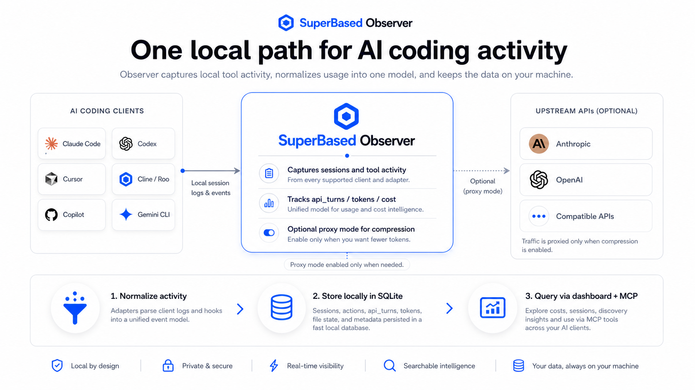
</p>

---

## Table of contents

- [What it is in 30 seconds](#what-it-is-in-30-seconds)
- [Install](#install)
- [First-run walkthrough](#first-run-walkthrough)
- [Dashboard tour](#dashboard-tour)
- [MCP server — 17 cross-tool intelligence calls](#mcp-server--13-cross-tool-intelligence-calls)
- [API proxy — accurate token capture + compression](#api-proxy--accurate-token-capture--compression)
- [Architecture](#architecture)
- [Teams & Org Visibility](#teams--org-visibility)
- [CLI reference](#cli-reference)
- [Configuration](#configuration)
- [Post-upgrade hygiene + recovery](#post-upgrade-hygiene--recovery)
- [Build from source](#build-from-source)
- [Contributing](#contributing)
- [License](#license)

---

## What it is in 30 seconds

A single Go binary that sits **passively** alongside Claude Code,
Cursor, Codex, Cline, GitHub Copilot CLI, Copilot (VS Code),
OpenCode, OpenClaw, Pi, Google Antigravity, Gemini CLI, and Cowork
— parsing their session logs, optionally proxying their API calls
for accurate token counts, and exposing the result through a local
dashboard, an MCP server (so the tools themselves can query it),
and a CLI.

**Everything stays on your machine.** The watcher, hook handler,
dashboard, MCP server, and CLI never make an outbound network call
on observer's behalf — no telemetry, no analytics, no remote
reporting. The only code paths that touch the network are the optional
API proxy (which forwards **your** requests unchanged to the AI
provider you already use) and a handful of explicit opt-in features
(message-summary LLM, codegraph MCP, Teams org-server). Full details:
[`PRIVACY.md`](PRIVACY.md).

<p align="center">
  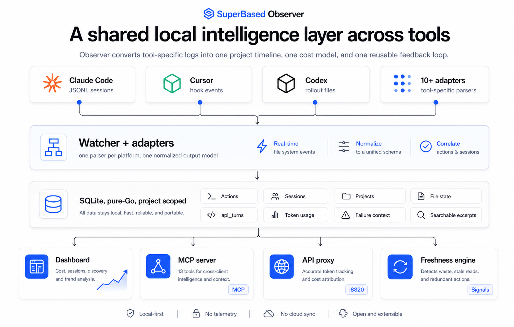
</p>

It answers questions like:

- Where did this week's $147 Claude bill come from — which projects,
  models, sessions, tool calls?
- Did I spend more on Opus or Sonnet? Are my Sonnet sessions hitting
  the long-context tier and getting repriced at 2×?
- How much did I waste re-reading files that hadn't changed since
  the last read in the same session?
- Could that trivial Opus session have been done by Sonnet for 1/5
  the cost?
- Across Claude Code, Cursor, and Codex working in the same repo,
  what files are touched by all three? Where are they stepping on
  each other?

---

## Install

Pick whichever package manager fits your environment — npm and PyPI
ship the same prebuilt binary from the same `v*` tag, version
numbers kept in lock-step.

### Via npm (recommended for Node users)

```bash
npm install -g @superbased/observer
observer --version
```

### Via pip / uv / pipx (recommended for Python users)

```bash
pip install superbased-observer            # plain pip
uv tool install superbased-observer        # uv (isolated env, fastest)
pipx install superbased-observer           # pipx (isolated env)
observer --version
```

Wheels ship for `manylinux2014_{x86_64,aarch64}`,
`macosx_*_{x86_64,arm64}`, and `win_amd64`. `uv tool` and `pipx`
keep the install isolated from your project's Python env — generally
what you want for a CLI tool.

### Via go install (latest main, builds locally)

```bash
go install github.com/marmutapp/superbased-observer/cmd/observer@latest
observer --version
```

### Via direct download (pre-built per-platform archive)

Each tagged release attaches per-platform archives to the
[Releases page](https://github.com/marmutapp/superbased-observer/releases),
verifiable against the published `SHA256SUMS`:

| Asset | Platform | Contents |
|---|---|---|
| `observer-vX.Y.Z-linux-x64.tar.gz` | Linux x86_64 | `observer` + `antigravity-bridge.exe` (for WSL2) |
| `observer-vX.Y.Z-linux-arm64.tar.gz` | Linux arm64 | `observer` + `antigravity-bridge.exe` (for WSL2) |
| `observer-vX.Y.Z-darwin-x64.tar.gz` | macOS Intel | `observer` |
| `observer-vX.Y.Z-darwin-arm64.tar.gz` | macOS Apple Silicon | `observer` |
| `observer-vX.Y.Z-win32-x64.zip` | Windows x86_64 | `observer.exe` |
| `SHA256SUMS` | — | sha256 of all five archives |

```bash
# Linux x64 example — substitute your platform + version.
VERSION=v1.6.21
PLAT=linux-x64
curl -L -O https://github.com/marmutapp/superbased-observer/releases/download/$VERSION/observer-$VERSION-$PLAT.tar.gz
curl -L -O https://github.com/marmutapp/superbased-observer/releases/download/$VERSION/SHA256SUMS
shasum -a 256 -c SHA256SUMS --ignore-missing
tar -xzf observer-$VERSION-$PLAT.tar.gz
./observer --version
```

The binary is pure Go — no CGO, no external runtime dependencies.
SQLite storage is pure-Go via `modernc.org/sqlite`. Single static
binary; `scp` it anywhere it runs. Same artifacts ship to npm and to
the Releases page (build-once-ship-everywhere CI), so the npm and
direct-download paths produce byte-identical binaries.

---

## First-run walkthrough

```bash
# 1. Register hooks + MCP entries with every detected AI tool.
#    Patches ~/.claude/settings.json, ~/.cursor/hooks.json,
#    ~/.claude.json, ~/.cursor/mcp.json, ~/.codex/config.toml.
observer init --all

# 2. Backfill from existing session logs so the dashboard has
#    history immediately rather than starting empty.
observer scan

# 3. Run proxy + watcher daemon + dashboard.
#    Foreground; ctrl-c to stop. Dashboard at http://localhost:8081.
observer start
```

**What each command does** — and what `start` alone does NOT do:

- `observer init` writes hook entries AND MCP server entries into each
  AI tool's own config files. Hooks default ON, MCP defaults ON; opt out
  per-side with `--skip-hooks` / `--skip-mcp`. Idempotent.
- `observer scan` is a one-shot historical backfill from existing
  session logs.
- `observer start` runs the API proxy, the live watcher, and the
  dashboard in one foreground process. **It also auto-registers
  hooks** for any detected AI tool that doesn't yet have them — so a
  user who skipped step 1 still gets live capture. **It does NOT
  register the MCP server** — MCP wiring is explicit-only, via
  `observer init`. If you don't want the MCP tools in your AI client,
  just never run `init`, or run `init --skip-mcp`.

For accurate token counts (rather than parsing whatever the JSONL
adapter could see) **and to enable conversation compression**, point
your AI tool at the proxy:

```bash
# Claude Code (Anthropic) — both env vars matter:
export ANTHROPIC_BASE_URL=http://localhost:8820
export ENABLE_TOOL_SEARCH=true   # ← required; without it the proxy is a net loss

# Codex / OpenAI-family tools:
export OPENAI_BASE_URL=http://localhost:8820/v1

# Restart the AI tool — it'll route through the proxy from now on.
```

**Why `ENABLE_TOOL_SEARCH=true` matters.** Claude Code's SDK
disables `ToolSearch:optimistic` deferred MCP loading whenever
`ANTHROPIC_BASE_URL` is set, eagerly inlining all 17 observer MCP
tool schemas (plus any Google MCPs) into every request prefix —
~+21K tokens/turn. The override re-enables lazy loading; observer's
proxy forwards `tool_reference` blocks byte-identically, satisfying
the SDK's documented safety condition. Empirical: with the override +
v1.7.23 defaults, the proxy is **−6.9% mean cost vs no-proxy** on
Claude Code's reference rig (n=8 lumen refactor task, V7-22 binary).
Without it, ~+9% per-turn overhead. See [the cost-tuning skill](docs/skills/observer-cost-tuning/)
for the full picture.

The proxy logs every turn with the exact token counts the provider
returned, including cache-tier breakdowns (5m vs 1h ephemeral) and
1h surcharges that JSONL adapters can't always disambiguate.

### Verifying the install

```bash
observer doctor          # health checks: DB integrity, hook
                         # registration, MCP entries, pid bridge
observer status          # row counts + recent activity
observer tail            # live-stream captured actions
```

---

## Dashboard tour

Open <http://localhost:8081> after `observer start`. Ten tabs, each
designed around one question.

### Overview — what's been happening?

<p align="center">
  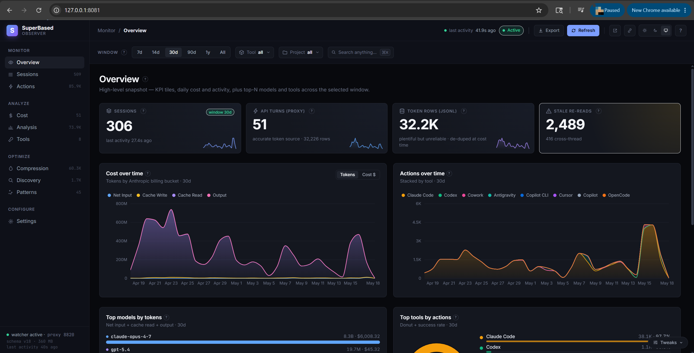
</p>

Four headline KPI tiles (sessions, API turns, token rows, stale
re-reads — each filterable by the global Window / Tool / Project
chips), cost-over-time stacked area split by billable token bucket,
actions-over-time stacked by tool, top models by token volume, top
tools by action count.

### Sessions — what did each run actually do?

<p align="center">
  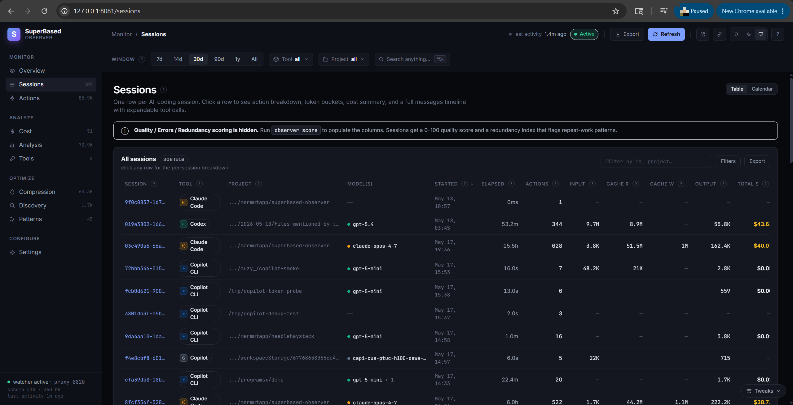
</p>

One row per session with cost, token totals (input / cache R /
cache W / output), elapsed time, action count, and a model badge.
Quality / Errors / Redundancy scoring columns light up once
`observer score` has run. Click a row to open the per-session
slide-over (shown below in [Session detail](#session-detail--drill-into-one-session)).

### Actions — the firehose, filtered

<p align="center">
  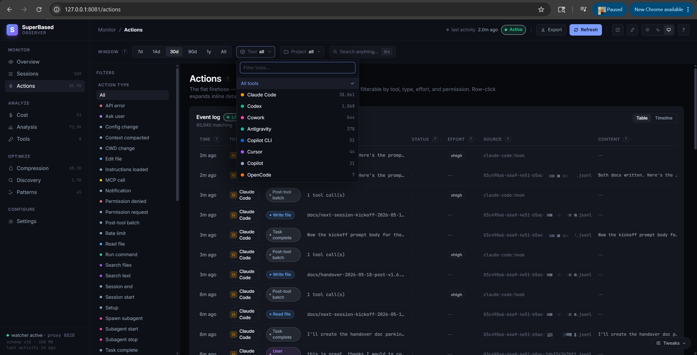
</p>

Every recorded tool call, normalized across adapters. Filter by
action type (28 categories), tool, effort, permission. Each row
exposes its `target` + status + raw-tool source + truncated content
preview; click to expand to the full event with error context.

### Cost — per-model breakdown with the right math

<p align="center">
  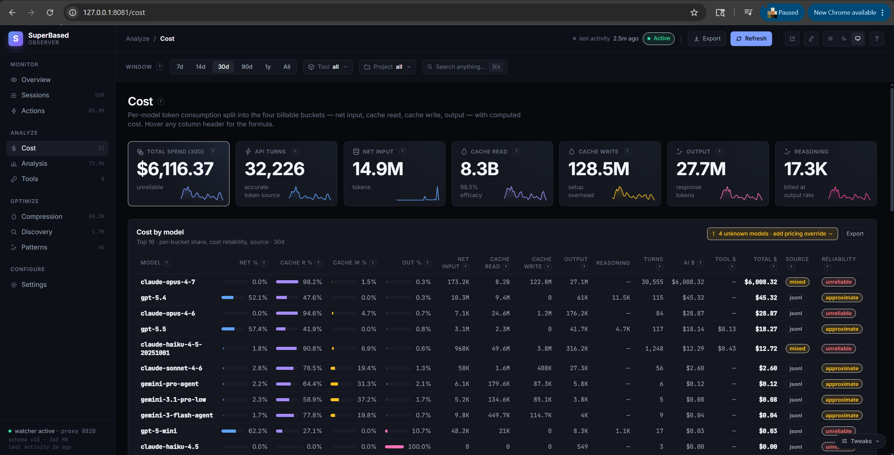
</p>

Eight KPI tiles across the billable token buckets (Net Input, Cache
Read, Cache Write 5m, Cache Write 1h, Output, Reasoning, plus total
USD and turn count). Per-model table shows the full breakdown
including reasoning tokens (billed at output rate) and long-context
surcharges (Sonnet 1M, gpt-5 >272K, Gemini 2.5 Pro >200K). Hover
any column header for its definition + formula.

### Analysis — spending insights & efficiency signals

<p align="center">
  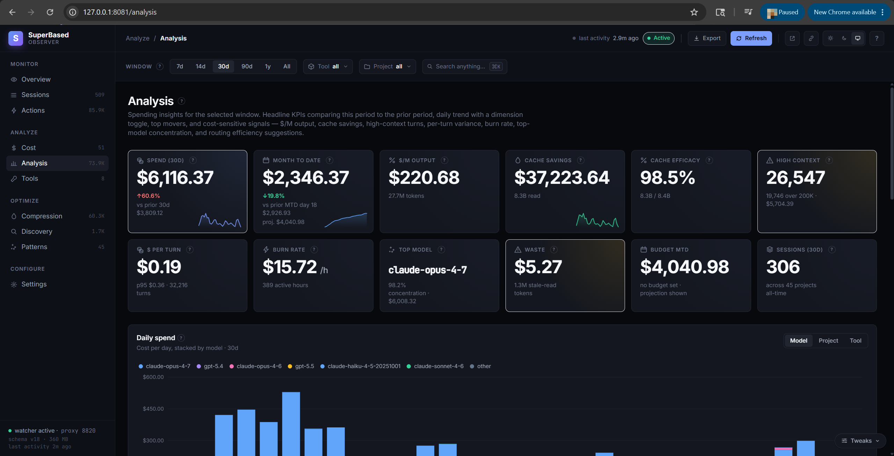
</p>

Twelve KPI tiles comparing this period to prior: spend Δ%, MTD vs
budget with projection bar, $/M output rate, cache savings + cache
efficacy %, high-context turn count, $/turn, burn rate ($/active
hour), top model concentration %, Discovery waste $, sessions
total. Daily-spend stacked bars with Model / Project / Tool
dimension toggle, hour-of-day heatmap, period-over-period movers
(top increases / decreases / new entrants), and routing-efficiency
suggestions (trivial Opus sessions that could have used Sonnet).

### Tools — per-AI-client breakdown

<p align="center">
  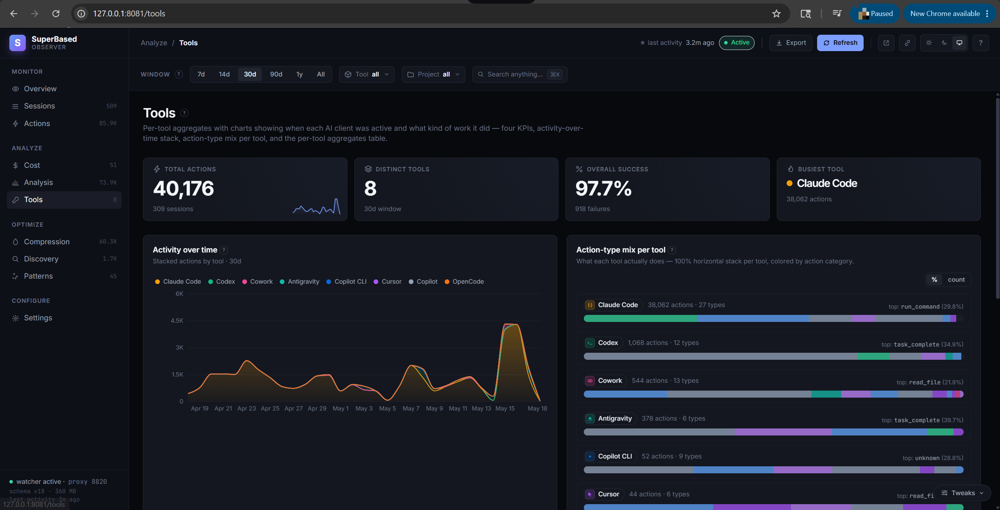
</p>

Four KPIs (total actions, distinct tools, overall success rate,
busiest tool), activity-over-time stacked area, and per-tool
action-type-mix horizontal bars (100% normalized, colored by action
category). Surfaces which AI client owned which kind of work.

### Compression — what the proxy saved

<p align="center">
  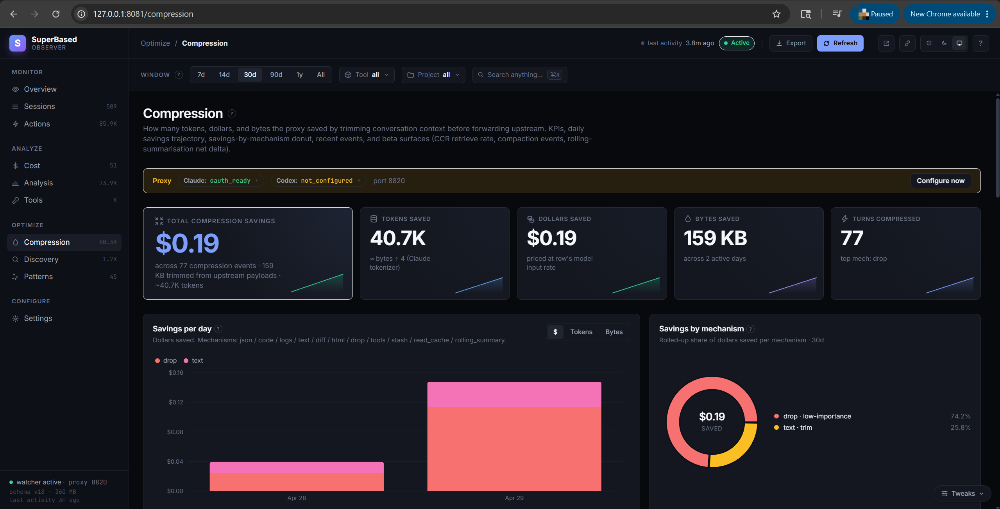
</p>

Five KPIs: total $ saved (priced at your input rate), tokens saved,
bytes trimmed, turns compressed. Savings-per-day stacked bar by
mechanism (drop, trim, summary), savings-by-mechanism donut, recent
events table with original→compressed→saved + dollar impact per
event.

### Discovery — the waste detector

<p align="center">
  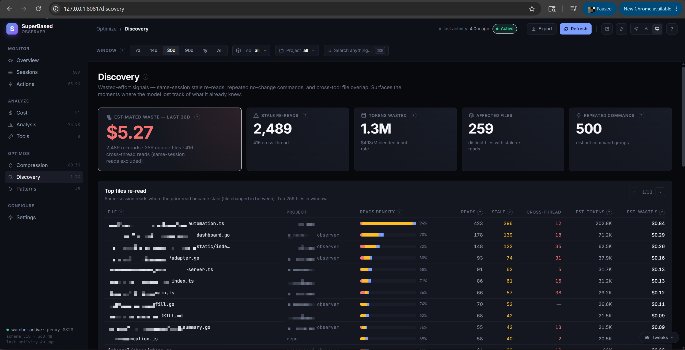
</p>

Waste $ hero (stale-read tokens × your blended input rate). Four
KPIs: stale re-reads count, tokens wasted, affected files, repeated
commands. Top files re-read table with cross-thread highlighting
(when the same file was re-read from a subagent that didn't see the
parent's read). Repeated-commands table with no-change-rerun
detection.

### Settings — every config knob, editable

<p align="center">
  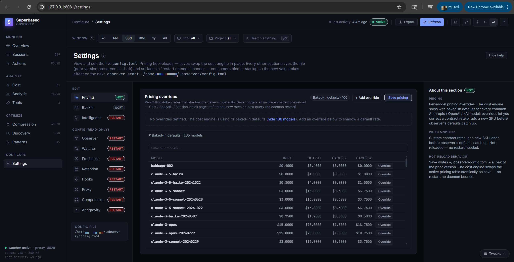
</p>

Pricing overrides hot-reload (no daemon restart — `cost.Engine`
swaps the pricing table atomically). 156 baked-in default models;
"Override" prompts auto-fill from the default. Backfill mode panel
spawns `observer backfill` as a child process with live output
streamed back. Watcher / Freshness / Retention / Hooks / Proxy /
Compression / Intelligence sections are schema-driven forms with
inline help. Restart-required banner appears when a section is
saved that the daemon binds at startup.

### Session detail — drill into one session

<p align="center">
  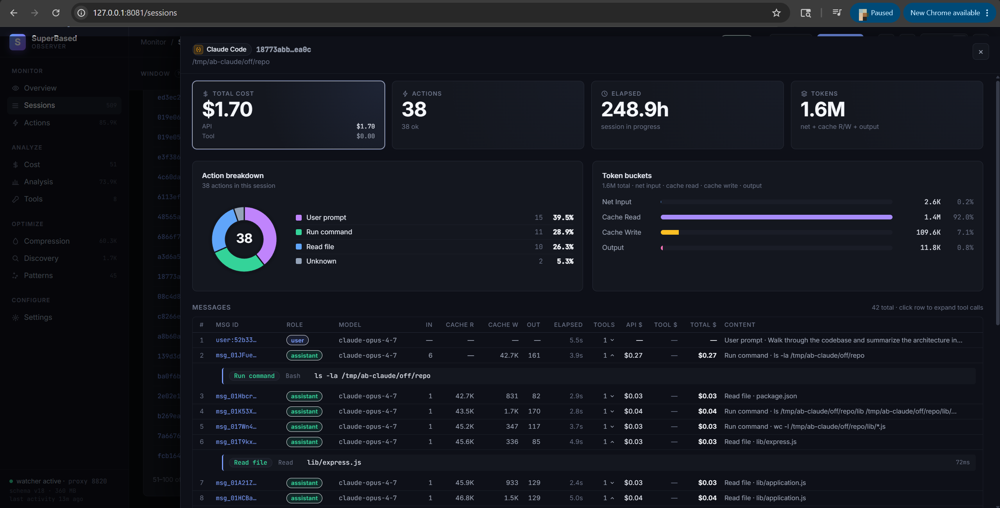
</p>

Click any session row → slide-over with action-type breakdown
donut, token-bucket bar (input / cache R / cache W / output),
per-message timeline showing every upstream API turn with model,
tokens, cost, and the tool calls inside it. Same panel surfaces
from Actions when clicking a session pill.

---

## MCP server — 17 cross-tool intelligence calls

**Opt-in.** The MCP server is not active until you run
`observer init` (or `observer init --claude-code` / `--cursor` /
`--codex`). That command writes entries pointing at the observer
binary into each AI tool's own MCP config file
(`~/.claude.json`, `~/.cursor/mcp.json`, `~/.codex/config.toml`).
The MCP server then runs as a **stdio subprocess spawned by your AI
tool** — its lifecycle matches the AI tool's, and it never opens a
network port. `observer start` alone does NOT register or launch
the MCP server; it can be skipped entirely via
`observer init --skip-mcp` if you want hooks-only capture.

Once registered, every connected AI tool can query the observer
over MCP/stdio:

| MCP tool | What it answers |
|---|---|
| `check_file_freshness` | Has this file changed since I last read it? |
| `check_command_freshness` | Did this exact command already run? With what result? |
| `get_file` | The file's current bytes (or at a given commit), with path-safety gate + audit. |
| `get_file_history` | Every read/edit of this file across every tool + session (with codegraph enrichment when available). |
| `get_session_summary` | What did session X actually do? AI-generated 2–4 sentence summaries. |
| `get_session_recovery_context` | For resuming an interrupted session. |
| `get_project_patterns` | Derived behaviours: hot files, co-changes, edit→test pairs. |
| `get_last_test_result` | Without re-running. |
| `get_failure_context` | Error correlation + retry detection. |
| `get_action_details` | The raw row, scrubbed of secrets. |
| `get_cost_summary` | Per-window spend rollup. |
| `get_redundancy_report` | What would Discovery flag for this project? |
| `get_relations` | Codegraph BFS — who calls / is called by this symbol. |
| `get_symbols` | Resolve symbol name + range to file path + body (codegraph-backed). |
| `list_actions_around` | Chronological ±N actions around an `action_id`. |
| `search_past_outputs` | Full-text search of past tool-call outputs (FTS5 over excerpts). |
| `retrieve_stashed` _(conditional)_ | Pulls original bytes of a tool_result the proxy stashed (only registered when CCR is enabled). |

**Operator note for Claude Code via observer's proxy.** When you set
`ANTHROPIC_BASE_URL=http://localhost:8820`, Claude Code's SDK
disables `ToolSearch:optimistic` deferred MCP loading — observer's
17 tool schemas (plus any Google MCPs you've registered) end up
eagerly inlined into every request prefix, ~+21K tokens/turn. **Set
`ENABLE_TOOL_SEARCH=true` in the same shell** to recover lazy
loading; observer's proxy forwards `tool_reference` blocks
byte-identically, satisfying the SDK's documented safety condition
for the override. See [the cost-tuning skill](docs/skills/observer-cost-tuning/)
for the full picture.

Knowledge captured from one tool benefits all the others working on
the same project — data is organized by git root, not by tool. A
read by Claude Code becomes a freshness signal for Codex; a Cursor
compaction is visible from Cline.

---

## API proxy — accurate tokens, compression, stash

The proxy is the home of three features that only exist when your AI
client routes through it. None of them run on the watcher / `observer
start` ingestion path — compression and stash live in the request
path because that's the only place where bytes can be rewritten
before they reach the upstream provider.

When you point your AI tool at `http://localhost:8820`, the proxy:

1. **Forwards your request to your chosen upstream** (Anthropic or
   OpenAI). The destination is the same provider URL your AI client
   would have called directly; no data leaves your machine that
   wasn't already going to that provider. Your API key is yours —
   the proxy reads it from the inflight headers, never stores it.
2. **Records the exact token counts** the provider returned (cache
   5m vs 1h split, long-context tier triggers, reasoning tokens)
   into the `api_turns` table — more accurate than parsing the
   JSONL the AI tool wrote.
3. **Compresses the conversation** before forwarding
   (importance-scored, prefix-stable for cache alignment) — the
   biggest lever for keeping long sessions inside rate-limit
   windows. **On by default** as of v1.7.23 with the safe per-type
   set (`compress_types = ["json","logs","code"]`); opt out via
   `[compression.conversation].enabled = false` or
   `compress_types = []`. Compressed events land in the
   `compression_events` table and surface on the Compression
   dashboard tab. Empirical on Claude Code lumen rig (n=8, V7-22):
   **−6.9% mean cost vs no-proxy**, CV 7.6%, zero tail outliers.
4. **Stashes large tool outputs** the compressor hides, so the
   originals stay retrievable via the `retrieve_stashed` MCP tool
   (only registered when stash is configured). **Off by default —
   stash markers break Anthropic's prefix cache** (V7-25 n=1
   measurement: +25% cost, `cache_creation_input_tokens` doubled).
   Operators who want stash on a workload should A/B before
   committing.

Three compression layers, each independently toggleable:

- **Shell output filters** — RTK-style truncation of large `bash` /
  `git` / `go test` / `docker` / `kubectl` / `cargo` / `pytest`
  outputs inline before they hit the LLM context. Runs on hook /
  `observer run` paths; does not require the proxy.
- **Tool output indexing** — every tool call's output indexed into
  FTS5; large outputs trimmed to a 2KB excerpt cap so the index
  stays compact and `search_past_outputs` stays fast. Runs on the
  watcher path; does not require the proxy.
- **Conversation compression** — proxy rewrites large `tool_result`
  blocks before forwarding upstream. **Proxy-only** — there is no
  non-proxy path for this layer, and the stash that backs
  `retrieve_stashed` is wired here too.

**Trade-off if you skip the proxy:** you still get full hook + JSONL
ingestion, the dashboard, MCP (if registered), and shell+indexing
compression. You lose proxy-grade token accuracy, conversation
compression, and the stash. For rate-limited plans (Claude Teams 5h/7d
windows), conversation compression is usually the difference between
"finishes the task" and "hits the limit."

### Choosing a compression mode (Anthropic vs Codex)

`[compression.conversation].mode` behaves differently per provider. Per-type
`tool_result` compression runs in every mode; `mode` only changes how messages
are dropped and whether an Anthropic `cache_control` marker is injected.

| `mode` | What it does | Claude Code (Anthropic) | Codex / OpenAI |
|---|---|---|---|
| `token` | Per-type compress, then drop lowest-scored messages to hit `target_ratio`. | ✅ Works. | ✅ Clearest choice for Codex/OpenAI. |
| `cache` | Restrict drops to the tail half + inject a `cache_control` marker at the prefix boundary. | ✅ Anthropic-specific. | ⚠️ No effect beyond `token`. |
| `cache_aware` *(default)* | Skip drops, narrow compression to `tool_result` blocks, no marker injection; keep history byte-stable across turns so Anthropic's prefix cache keeps hitting (`cache_creation` falls on later turns). | ✅ **Recommended for Anthropic Pro/Max** — and the shipped default. | ⚠️ No effect beyond `token`, so the default is harmless for Codex. |

The shipped default is `cache_aware` (`token` is just the internal fallback when
`mode` is empty). The `cache`/`cache_aware` strategies exist for **Anthropic's
content-hash prefix cache** (`cache_control` is an Anthropic Messages API
concept). OpenAI/Codex prompt caching is **automatic and server-side** — there
is nothing to mark or tune, so the proxy's OpenAI path is mode-agnostic (the
default `cache_aware` simply behaves like `token` there).

**Pick one of three shipped recipes based on which model you're running:**

| Recipe | Use it when your model is… | Example model IDs |
|---|---|---|
| **`claude-code`** | Anthropic Claude (via Claude Code) | `claude-sonnet-4-6`, `claude-opus-4-7`, `claude-haiku-4-5`, any `claude-*` |
| **`codex-variant`** | OpenAI's `-codex` reasoning fork (running under the codex CLI) | `gpt-5.3-codex`, `gpt-5.4-codex`, `gpt-5-codex-agent`, anything matching `*-codex*` |
| **`codex-safe`** | Plain OpenAI GPT (running under the codex CLI) | `gpt-5.4`, `gpt-5.4-mini`, `gpt-5.5`, `gpt-4o`, any non-`-codex` GPT |

"variant" in `codex-variant` means the `-codex` *model variant*, not a variant of the codex CLI — both codex recipes are for the codex CLI; the split is purely about which model family it's pointed at.

```toml
# claude-code recipe (v1.7.23 defaults, Anthropic Pro/Max)
[compression.conversation]
enabled         = true
mode            = "cache_aware"
target_ratio    = 0.85
preserve_last_n = 5
compress_types  = ["json", "logs", "code"]   # the V7-24 empirical winner

[compression.conversation.stash]
enabled = false                              # V7-25: stash breaks Anthropic cache
```

Empirical: n=4 OFF vs n=8 B-arm via observer with this recipe + `ENABLE_TOOL_SEARCH=true` = **−6.9% mean cost** vs no-proxy. CV 7.6% (tighter than OFF's 7.5%), zero tail outliers, 136 `code` compression events saving 154,445 bytes (10.1%). Full data: [`docs/v1.7.23-compression-savings-empirical-2026-06-01.md`](docs/v1.7.23-compression-savings-empirical-2026-06-01.md).

```toml
# codex-variant recipe — for -codex family models (gpt-5.3-codex, gpt-5.4-codex)
[compression.conversation]
enabled         = true
mode            = "cache_aware"
target_ratio    = 0.99
preserve_last_n = 50
compress_types  = []   # codex variants are reactive; any compression hurts (V7-2)
```

V7-21 empirical (n=10, gpt-5.3-codex, codex CLI lumen task): $0.270 mean vs OFF $0.30 = **−10%**. Per-type compression must stay empty for `-codex` family models — they re-derive when tool_results change.

```toml
# codex-safe recipe — for non-codex OpenAI models (gpt-5.4, gpt-5.5, gpt-5.4-mini)
[compression.conversation]
enabled         = true
mode            = "token"
target_ratio    = 0.95
preserve_last_n = 15
compress_types  = ["logs"]   # JSON sentinel substitution corrupts codex tool data
```

V7-21 empirical (n=10, gpt-5.4-mini × medium/high/xhigh): −22% to −56% cost vs Anthropic-style defaults. V7-26 re-measurement on gpt-5.4 + apply_patch workload: **inconclusive** — the workload didn't classify any tool_result as `Logs`, so the proxy was a functional no-op; cost variance was session noise. Operators on gpt-5.4 should A/B their own workload before assuming codex-safe delivers savings on their traffic shape.

Then point your client at the proxy — `ANTHROPIC_BASE_URL=http://127.0.0.1:8820` + `ENABLE_TOOL_SEARCH=true` (Claude Code) or `OPENAI_BASE_URL=http://127.0.0.1:8820/v1` (Codex) — and restart it. Full knob reference (stash, rolling-summary's per-provider model split, compaction): [`docs/compression-modes.md`](docs/compression-modes.md).

---

## Architecture

```
┌──────────────┐     ┌──────────────┐     ┌──────────────┐
│  Claude Code │     │    Cursor    │     │    Codex     │   ... 14 adapters
└──────┬───────┘     └──────┬───────┘     └──────┬───────┘
       │ JSONL              │ hook events       │ rollout files
       ▼                    ▼                    ▼
┌────────────────────────────────────────────────────────┐
│              fsnotify Watcher + Adapters                │
│       (one parser per platform, normalized output)      │
└────────────────────────┬───────────────────────────────┘
                         │ ToolEvent / Action / Session
                         ▼
┌────────────────────────────────────────────────────────┐
│   SQLite (WAL, pure-Go via modernc.org/sqlite)          │
│   actions · sessions · projects · file_state ·          │
│   api_turns · token_usage · failure_context ·           │
│   compaction_events · action_excerpts (FTS5)            │
└────────────────────────┬───────────────────────────────┘
                         │
        ┌────────────────┼────────────────────────┐
        ▼                ▼                        ▼
┌──────────────┐  ┌──────────────┐       ┌──────────────┐
│   Dashboard   │  │  MCP Server  │       │   API Proxy  │
│  HTTP+/api/*  │  │ stdio · 13   │       │  Anthropic + │
│  10 tabs      │  │  tools       │       │  OpenAI      │
└──────────────┘  └──────────────┘       └──────────────┘
                                                 │
                                                 ▼
                                          upstream API
                                          (traffic passes
                                           through verbatim,
                                           with token tracking
                                           + optional compression)
```

Adapters parse each platform's session format into a unified
`Action` row. The cost engine reads `api_turns` (proxy, accurate)
and `token_usage` (JSONL adapters, approximate) and deduplicates
per-turn via the upstream `request_id` ↔ `source_event_id` match.
The MCP server exposes the same database. The dashboard pulls JSON
from the same `/api/*` endpoints the MCP tools use.

---

## Teams & Org Visibility

For teams, an optional **`observer-org`** server gives admins org-wide
visibility — per-developer and per-team spend, project rollups, and budgets —
without changing the solo-local experience at all. It is purely additive: a
developer who never enrols sees a byte-identical local tool. Developers opt in
with `observer enroll <org-url> <token>`, after which the agent pushes
**content-free** rollup rows (signed, gzipped, deduplicated) to the server.
Authentication is SAML SSO for humans, SCIM 2.0 for provisioning, and Ed25519
bearers for agents; no prompts, command bodies, or file contents ever leave the
machine. The server ships as a signed Docker image
(`ghcr.io/marmutapp/observer-org`) and a Helm chart (`charts/observer-org/`).

Independently, each agent can export per-turn LLM spans to your own
OpenTelemetry collector (`gen_ai.*` + `sbo.*` attributes, off by default).

- **[Getting started](docs/teams-getting-started.md)** — install the server,
  wire up SAML/SCIM, enrol your first agent, verify data flows.
- **[Architecture](docs/teams-architecture.md)** — components, runtime data
  flow, the security and privacy model, source map.
- **[Operations](docs/teams-operations.md)** — backup/restore, key rotation,
  upgrades, troubleshooting.

---

## CLI reference

| Command | Purpose |
|---|---|
| `observer init [--all]` | Register hooks + MCP server with every detected AI tool. |
| `observer uninstall [--all] [--purge]` | Reverse of `init`. Refuses to touch drifted configs unless `--force`. `--purge` also deletes `~/.observer/`. |
| `observer scan [--force]` | One-time backfill — parse all known session files into the DB. `--force` re-walks from offset 0. |
| `observer watch` | Live fsnotify-based watcher daemon. |
| `observer start` | Proxy + watcher + dashboard in one foreground process. |
| `observer proxy start` | Run only the API reverse proxy. |
| `observer dashboard [--port N]` | Embedded dashboard + `/api/*` JSON on http://localhost:N (default 8081). |
| `observer cost [--days N] [--group-by …]` | Token + USD rollup from the CLI. |
| `observer discover` | Stale re-reads + redundant-commands report. |
| `observer patterns` | Derive hot files, co-changes, common commands, edit→test pairs. |
| `observer learn` | Derive correction rules from failure→recovery pairs. |
| `observer suggest` | Compose patterns + corrections into CLAUDE.md / AGENTS.md / .cursorrules. |
| `observer summarize` | Generate AI session summaries (uses Anthropic Haiku). |
| `observer score` | Session quality scoring (error rate, redundancy, onboarding cost, retry cost). |
| `observer status` | Row counts + recent activity. |
| `observer tail` | Live-stream captured actions. |
| `observer doctor` | Health checks: DB integrity, hook checksums, MCP drift, pid bridge. |
| `observer prune` | Run retention now. |
| `observer metrics [--port N]` | Prometheus `/metrics` endpoint. |
| `observer export {json\|csv\|xlsx}` | Dump tables for external analysis. |
| `observer backfill --<mode>` | Re-populate columns added by later migrations. `--all` runs every mode. |
| `observer run <command>` | Run a command with its stdout streamed through the shell filter. |
| `observer hook <tool> <event>` | Hook entrypoint (called by the AI tools after `init`). |
| `observer serve` | MCP stdio server (spawned by AI tools). |

`observer <command> --help` for full flag listings.

---

## Configuration

Default location: `~/.observer/config.toml`. Override with
`--config`. A minimal config:

```toml
[observer]
db_path = "~/.observer/observer.db"
log_level = "info"

[proxy]
enabled = true
port = 8820
anthropic_upstream = "https://api.anthropic.com"
openai_upstream = "https://api.openai.com"

[intelligence]
monthly_budget_usd = 100   # surfaces on Analysis tab; 0 hides

[compression.shell]
enabled = true
exclude_commands = ["curl", "playwright"]

[compression.indexing]
enabled = true
max_excerpt_bytes = 2048

[compression.conversation]
enabled = false            # opt-in; modifies request bodies in flight
mode = "cache_aware"       # "token" | "cache" | "cache_aware" — see "Choosing a compression mode" below
target_ratio = 0.85
preserve_last_n = 5
compress_types = ["json", "logs", "code"]

# Per-model pricing overrides. Only specify what differs from baked-in.
[intelligence.pricing.models."claude-sonnet-4-6"]
input = 3.0
output = 15.0
cache_read = 0.30
cache_creation = 3.75
cache_creation_1h = 6.00

# Long-context tier example (Anthropic Sonnet 1M, gpt-5 >272K,
# Gemini 2.5 Pro >200K). When prompt exceeds the threshold, every
# rate is replaced with its long_context_* counterpart for that turn.
[intelligence.pricing.models."claude-sonnet-4-5"]
input = 3.0
output = 15.0
cache_read = 0.30
cache_creation = 3.75
cache_creation_1h = 6.00
long_context_threshold = 200000
long_context_input = 6.0
long_context_output = 22.50
long_context_cache_read = 0.60
long_context_cache_creation = 7.50
long_context_cache_creation_1h = 12.00
```

Every key has a TOML environment-variable override:
`OBSERVER_<SECTION>_<KEY>` (uppercased, underscores). Nested
sections join with extra underscores:
`OBSERVER_COMPRESSION_CONVERSATION_ENABLED=true`.

The Settings tab in the dashboard provides a fully-editable
visual editor for everything in `config.toml` — pricing
hot-reloads; other sections require a daemon restart (one-click
via the banner that appears after save).

---

## Post-upgrade hygiene + recovery

After upgrading the binary, or whenever the Actions tab looks
gappy (watcher fell behind, daemon restart with stale state,
fsnotify event drops):

```bash
observer backfill --all
```

Re-walks every JSONL the adapters know about from offset 0, then
runs the surgical column-update backfills (cache-tier, message-id,
etc.) on top. The `(source_file, source_event_id)` UNIQUE index
keeps the pass idempotent.

The dashboard surfaces a top-of-page banner whenever the watcher's
parse cursor for any session file is more than 10 KB behind the
on-disk size, so silent data loss has a visible signal.
`observer backfill --help` lists every supported flag.

---

## Build from source

```bash
git clone https://github.com/marmutapp/superbased-observer
cd superbased-observer
make build        # builds bin/observer + bin/antigravity-bridge.exe
make test         # full test suite (race detector enabled)
make all          # fmt + vet + lint + test + build
```

Requirements: **Go 1.22+**. No CGO. SQLite via `modernc.org/sqlite`
(pure Go). golangci-lint optional for `make lint`. Dashboard
source under `web/` (React + TypeScript + Vite + Tailwind); the
compiled bundle is committed to
`internal/intelligence/dashboard/webapp/dist/` so a contributor
who only touches Go can `make build` without Node.

If you edit `web/src/`:

```bash
# Hot-reload dev loop (Vite serves :5173, proxies /api/* to observer)
./bin/observer dashboard --addr 127.0.0.1:8081 &
cd web && npm install && npm run dev

# When done, rebuild the embedded bundle and commit
make web-build
git add internal/intelligence/dashboard/webapp/dist web/dist
```

`make web-build` regenerates both `web/dist` and the embedded copy.
Requires **Node 22 LTS**.

### CI gates

Every PR + push to `main` runs `.github/workflows/ci.yml`:

- **`frontend`** — `npm ci` → typecheck → build → dist-consistency
  check (asserts the committed embedded bundle matches a fresh build).
- **`go`** — `go vet` → `go test -race` → cross-compile.

Tag pushes (`v*`) trigger `.github/workflows/npm-release.yml`:
builds the frontend once, cross-compiles five platform binaries,
ships them to npm, and creates a GitHub Release.

---

## Contributing

PRs welcome. Table-driven tests in every package; >80% coverage on
core packages (cost, freshness, adapters, store). Run `make test`
before submitting; `make all` locally to catch fmt/vet/lint issues.
Conventional commits (`feat:` / `fix:` / `chore:` / `docs:` /
`test:` / `refactor:` / `perf:`).

For larger changes, open an issue first to align on scope. Adapter
contributions (a new AI coding tool to support) are particularly
welcome — see existing adapters in `internal/adapter/` for the
pattern.

---

## License

Apache 2.0 — see [`LICENSE`](LICENSE).
